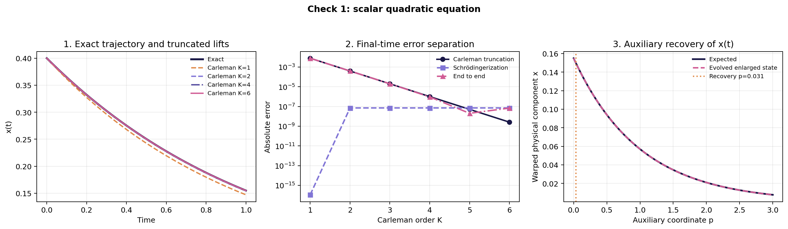
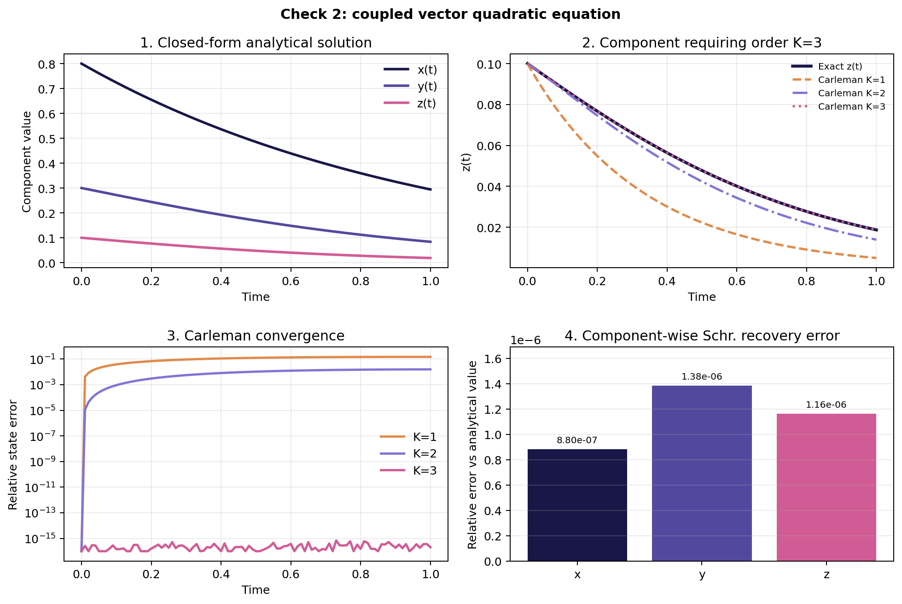

# Carleman linearization: two reproducible checks

## Overview

[`run_carleman_schrodingerization_demo.py`](../scripts/run_carleman_schrodingerization_demo.py) applies the same Carleman and Schrödingerization implementation to two quadratic differential equations for which analytical solutions are available:

1. A scalar nonlinear equation
2. A coupled three-component nonlinear system written in matrix form.

The first check makes the convergence with Carleman order particularly transparent. The second verifies that the implementation extends to vector states, cross-component quadratic terms, Kronecker products and a non-Hermitian lifted generator.

This document focuses on Carleman linearization and the numerical checks. The Schrödingerization construction, including the warped-phase transformation, auxiliary profile, Hermitian generator and recovery rule, is described in [`Schrodingerization_heat-equation.md`](Schrodingerization_heat-equation.md).

All calculations reported here are classical numerical validations of the Carleman--Schrödingerization pipeline. The enlarged Hermitian systems are evolved numerically using sparse-matrix operations; no gate-level circuit or quantum-hardware execution is included.

## Results at a glance

| Result | Value |
| --- | ---: |
| Scalar check: absolute Carleman error at $K=6$ | `2.5920e-9` |
| Scalar check: absolute end-to-end error at $K=6$ | `6.8997e-8` |
| Vector check: final-time relative Carleman error at $K=1$ | `14.82%` |
| Vector check: final-time relative Carleman error at $K=2$ | `1.559%` |
| Vector check: final-time relative Carleman error at $K=3$ | `2.03e-16` |
| Vector check: final-time relative Schrödingerization error at $K=3$ | `9.2862e-7` |
| Vector check: final-time relative end-to-end error | `9.2862e-7` |

All parameters, software versions and unrounded values are stored in [`carleman_schrodingerization_metrics.json`](../results/carleman_schrodingerization_metrics.json).

## 1. Carleman linearization

Consider a quadratic initial-value problem

$$
\boxed{
\dot{\mathbf x}
=
F_1\mathbf x+F_2(\mathbf x\otimes\mathbf x),
\qquad
\mathbf x(0)=\mathbf x_0
}.
$$

Here

$$
\mathbf x\in\mathbb C^n,
\qquad
F_1\in\mathbb C^{n\times n},
\qquad
F_2\in\mathbb C^{n\times n^2}.
$$

Carleman linearization introduces the tensor powers

$$
X_j=\mathbf x^{\otimes j},
\qquad j=1,2,\ldots .
$$

Differentiating them gives the linear hierarchy

$$
\dot X_j
=
A_{j,j}X_j+A_{j,j+1}X_{j+1},
$$

where

$$
A_{j,j}
=
\sum_{r=0}^{j-1}
I^{\otimes r}\otimes F_1\otimes I^{\otimes(j-r-1)},
$$

and

$$
A_{j,j+1}
=
\sum_{r=0}^{j-1}
I^{\otimes r}\otimes F_2\otimes I^{\otimes(j-r-1)}.
$$

The hierarchy is infinite. At truncation order $K$, the script retains

$$
X_K^C
=
\begin{bmatrix}
X_1\\X_2\\\vdots\\X_K
\end{bmatrix}
=
\begin{bmatrix}
\mathbf x\\
\mathbf x^{\otimes2}\\
\vdots\\
\mathbf x^{\otimes K}
\end{bmatrix}
$$

and discards the coupling from $X_K$ to $X_{K+1}$. The finite linear equation is

$$
\boxed{
\dot X_K^C=C_KX_K^C
}.
$$

Its initial condition is fixed by the original state:

$$
X_K^C(0)
=
\begin{bmatrix}
\mathbf x_0\\
\mathbf x_0^{\otimes2}\\
\vdots\\
\mathbf x_0^{\otimes K}
\end{bmatrix}.
$$

The direct truncated solution is

$$
X_K^C(t)=e^{C_Kt}X_K^C(0),
$$

and its first $n$ entries approximate the original state $\mathbf x(t)$.

After constructing $C_K$, the script also evolves the same linear system through the Schrödingerization procedure documented in [`Schrodingerization_heat-equation.md`](Schrodingerization_heat-equation.md). Here, “Schrödingerization error” means the difference between that recovered result and the direct matrix-exponential value $e^{C_Kt}X_K^C(0)$.

## 2. Check 1: scalar quadratic equation

### 2.1 Differential equation and analytical solution

The first check uses

$$
\boxed{
\dot{x}=-x+0.2x^2,
\qquad
x(0)=0.4,
\qquad
0\leq t\leq1
}.
$$

Its analytical solution is

$$
\boxed{
x_{\mathrm{exact}}(t)
=
\frac{x_0e^{-t}}
{1-0.2x_0(1-e^{-t})}
}.
$$

In matrix notation,

$$
n=1,
\qquad
F_1=[-1],
\qquad
F_2=[0.2].
$$

Because $X_j=x^j$,

$$
\frac{d}{dt}x^j
=
-j x^j+0.2j x^{j+1}.
$$

The order-$K$ Carleman matrix is therefore

$$
\boxed{
C_K
=
\begin{bmatrix}
-1 & 0.2 & 0 & \cdots & 0\\
0 & -2 & 0.4 & \ddots & \vdots\\
0 & 0 & -3 & \ddots & 0\\
\vdots & \ddots & \ddots & \ddots & 0.2(K-1)\\
0 & \cdots & 0 & 0 & -K
\end{bmatrix}
}.
$$

The discarded term in the last equation is $0.2Kx^{K+1}$. This is the source of the finite-order Carleman error.

### 2.2 Results

For each $K=1,\ldots,6$, the script compares:

1. The analytical value $x_{\mathrm{exact}}(1)$
2. The first component of $e^{C_K}X_K^C(0)$
3. The first component recovered after Schrödingerizing the same $C_K$

| $K$ | Lifted dimension | Absolute Carleman error | Absolute Schrödingerization error | Absolute end-to-end error |
| ---: | ---: | ---: | ---: | ---: |
| 1 | 1 | `7.8378e-3` | `1.11e-16` | `7.8378e-3` |
| 2 | 2 | `3.9635e-4` | `7.13e-8` | `3.9628e-4` |
| 3 | 3 | `2.0043e-5` | `7.15e-8` | `1.9972e-5` |
| 4 | 4 | `1.0136e-6` | `7.16e-8` | `9.4200e-7` |
| 5 | 5 | `5.1257e-8` | `7.16e-8` | `2.0333e-8` |
| 6 | 6 | `2.5920e-9` | `7.16e-8` | `6.8997e-8` |



- **Panel 1 — Exact trajectory and truncated lifts.** The dark curve is the analytical nonlinear solution. The other curves are the first component of the Carleman systems at several truncation orders. At $K=1$, the quadratic contribution is discarded and the retained equation is simply $\dot X_1=-X_1$; its trajectory therefore lies below the analytical one. Increasing $K$ retains more of the hierarchy $x,x^2,x^3,\ldots$, thus the corresponding curves progressively approach the exact trajectory.

- **Panel 2 — Final-time error separation.** The horizontal axis is the Carleman order and the logarithmic vertical axis shows three absolute errors at $t=1$:

    - **Carleman truncation** compares the direct lifted solution with the analytical nonlinear solution
    - **Schrödingerization** compares the recovered state with the direct Carleman solution at the same $K$
    - **End to end** compares the Schrödingerized result with the analytical nonlinear solution

    The Carleman error decreases by approximately one to two orders of magnitude whenever $K$ is increased. The Schrödingerization error at $K=1$ is only `1.11e-16` because $C_1=[-1]$ produces a pure translation of the positive exponential auxiliary profile. In addition, $t=1$ is exactly 32 auxiliary-grid spacings, so this translation is represented without interpolation error and only floating-point round-off remains. This does not make $K=1$ physically accurate: its end-to-end error is still `7.8378e-3` because the quadratic term has been omitted.

    For $K\geq2$, the lifted matrices contain off-diagonal couplings and are no longer represented by a single scalar translation. The Schrödingerization and recovery error stabilizes near $7\times10^{-8}$ for the selected auxiliary discretization. Up to $K=4$, Carleman truncation is the dominant error. At $K=5$ and $K=6$, the Carleman error becomes smaller than this observed recovery-error floor, so increasing $K$ alone no longer improves the complete result. The end-to-end error is not the arithmetic sum of the other two errors because the corresponding signed discrepancies can partially cancel.

- **Panel 3 — Auxiliary recovery of the physical variable.** For $K=4$, the Carleman state is

    $$
    X_4^C=
    \begin{bmatrix}
    x&x^2&x^3&x^4
    \end{bmatrix}^{T}.
    $$

    Schrödingerization associates an auxiliary profile with each of these four entries. The panel displays only the first warped entry, corresponding to the original physical variable $x$; the components associated with $x^2$, $x^3$ and $x^4$ are internal lifted variables and are not plotted. After evolution to $t=1$, the expected positive branch is

    $$
    w_{\mathrm{expected}}(t,p)
    =
    e^{-p}x_{K=4}(t).
    $$

    The dashed evolved curve lies on top of this expected profile, showing that the enlarged Hermitian evolution preserves the required warped relation. The vertical dotted line marks the recovery coordinate $p_{\mathrm{rec}}=0.03125$, the first strictly positive auxiliary-grid point. Dividing the evolved value at this coordinate by $e^{-p_{\mathrm{rec}}}$ recovers $x_{K=4}(t)$.

Taken together, the three panels show that increasing $K$ systematically controls the nonlinear truncation error, while Schrödingerization and recovery introduce a separate observed error floor for the selected auxiliary discretization.

## 3. Check 2: coupled vector quadratic equation

### 3.1 Differential equation and parameter values

The second check uses

$$
\boxed{
\begin{aligned}
\dot x&=-x,\\
\dot y&=-2y+0.5x^2,\\
\dot z&=-3z+0.75xy,
\end{aligned}
\qquad
\begin{aligned}
x(0)&=0.8,\\
y(0)&=0.3,\\
z(0)&=0.1,
\end{aligned}
\qquad
0\leq t\leq1
}.
$$

With

$$
\mathbf u
=
\begin{bmatrix}x&y&z\end{bmatrix}^{T},
$$

the same equation is

$$
\boxed{
\dot{\mathbf u}
=
F_1\mathbf u+F_2(\mathbf u\otimes\mathbf u)
}.
$$

The linear matrix is

$$
\boxed{
F_1
=
\begin{bmatrix}
-1&0&0\\
0&-2&0\\
0&0&-3
\end{bmatrix}
}.
$$

Using the Kronecker ordering

$$
\mathbf u\otimes\mathbf u
=
\begin{bmatrix}
x^2&xy&xz&yx&y^2&yz&zx&zy&z^2
\end{bmatrix}^{T},
$$

the quadratic matrix is

$$
\boxed{
F_2
=
\begin{bmatrix}
0&0&0&0&0&0&0&0&0\\
0.5&0&0&0&0&0&0&0&0\\
0&0.375&0&0.375&0&0&0&0&0
\end{bmatrix}
}.
$$

In the full Kronecker representation, $xy$ and $yx$ are separate ordered entries even though they have the same scalar value. The coefficient $0.75$ is therefore split symmetrically between them as $0.375+0.375$, so that their combined contribution remains $0.75xy$.

Consequently,

$$
F_2(\mathbf u\otimes\mathbf u)
=
\begin{bmatrix}
0\\0.5x^2\\0.75xy
\end{bmatrix}.
$$

At the initial condition,

$$
\left\lVert F_2(\mathbf u_0\otimes\mathbf u_0)\right\rVert_2
=0.367151,
$$

so the nonlinear contribution is active.

### 3.2 Analytical solution

The triangular structure makes the exact solution available component by component:

$$
\boxed{
\begin{aligned}
x_{\mathrm{exact}}(t)
&=x_0e^{-t},\\
y_{\mathrm{exact}}(t)
&=e^{-2t}\left(y_0+0.5x_0^2t\right),\\
z_{\mathrm{exact}}(t)
&=e^{-3t}\left(
z_0+0.75x_0y_0t+0.1875x_0^3t^2
\right).
\end{aligned}
}.
$$

At $t=1$,

$$
\mathbf u_{\mathrm{exact}}(1)
\approx
\begin{bmatrix}
0.294303553\\
0.083907876\\
0.018719938
\end{bmatrix}.
$$

This reference is fully analytical; no numerical ODE solver is used to define the expected trajectory.

### 3.3 Why order 3 closes the relevant hierarchy

The equation for $y$ requires $x^2$, while the equation for $z$ requires $xy$. Their derivatives are

$$
\frac{d}{dt}x^2=-2x^2,
$$

and

$$
\frac{d}{dt}(xy)
=
-3xy+0.5x^3.
$$

The new degree-three term satisfies

$$
\frac{d}{dt}x^3=-3x^3.
$$

Therefore the dependency chain needed by the physical variables closes once degree three is retained. This gives a strong check:

- $K=1$ omits both nonlinear terms
- $K=2$ recovers $y$ exactly but misses the $x^3$ contribution required by $z$
- $K=3$ reproduces all three analytical components up to floating-point precision

### 3.4 Explicit order-3 Carleman system

For $n=3$ and $K=3$,

$$
X_1=\mathbf u,
\qquad
X_2=\mathbf u^{\otimes2},
\qquad
X_3=\mathbf u^{\otimes3},
$$

with dimensions 3, 9 and 27. The lifted dimension is

$$
N_3=3+9+27=39.
$$

The exact matrix constructed by the script is

$$
\boxed{
\frac{d}{dt}
\begin{bmatrix}
X_1\\X_2\\X_3
\end{bmatrix}
=
\underbrace{
\begin{bmatrix}
F_1 & F_2 & 0\\
0 & F_1\otimes I+I\otimes F_1 & F_2\otimes I+I\otimes F_2\\
0 & 0 & F_1\otimes I\otimes I+I\otimes F_1\otimes I+I\otimes I\otimes F_1
\end{bmatrix}
}_{C_3\in\mathbb R^{39\times39}}
\begin{bmatrix}
X_1\\X_2\\X_3
\end{bmatrix}
}.
$$

The initial lifted state is

$$
X_3^C(0)
=
\begin{bmatrix}
\mathbf u_0\\
\mathbf u_0^{\otimes2}\\
\mathbf u_0^{\otimes3}
\end{bmatrix}.
$$

### 3.5 Results

#### Stage 1: does Carleman reproduce the nonlinear solution?

This comparison does not involve Schrödingerization. For each order $K$, the finite Carleman system is evolved directly and only its first three entries, corresponding to $x$, $y$ and $z$, are compared with the analytical solution.

| $K$ | Carleman-system dimension | Maximum relative error in $(x,y,z)$ | Final-time relative error in $(x,y,z)$ |
| ---: | ---: | ---: | ---: |
| 1 | 3 | `14.8218%` | `14.8188%` |
| 2 | 12 | `1.55887%` | `1.55887%` |
| 3 | 39 | `6.84e-16` | `2.03e-16` |

At $K=3$, the three physical variables produced by the direct Carleman system agree with the analytical $x$, $y$ and $z$ values to floating-point precision. Therefore, the physical-state Carleman error at $t=1$ is `2.03e-16`.

This result concerns the first three physical entries. It does not state that every coordinate in the 39-component lift is an exact analytical monomial.

#### Stage 2: does Schrödingerization reproduce the selected Carleman system?

The $K=3$ Carleman system is now fixed. It contains three physical entries, $x$, $y$ and $z$, plus 36 tensor entries introduced by the lift.

The complete 39-entry initial state is first evolved directly through the action of $e^{C_3t}$. The same initial state is then evolved and recovered through Schrödingerization. Combining the 39 Carleman entries with 1,024 auxiliary points produces an enlarged Hermitian system of dimension

$$
39\times1{,}024=39{,}936.
$$

| Check | What is compared at $t=1$ | Entries compared | Relative error |
| --- | --- | ---: | ---: |
| Physical-state recovery | Recovered $(x,y,z)$ vs direct Carleman $(x,y,z)$ | 3 | `9.2862e-7` |
| Complete-lift recovery | All recovered Carleman coordinates vs all directly evolved Carleman coordinates | 39 | `1.0503e-6` |
| Physical end to end | Recovered $(x,y,z)$ vs analytical $(x,y,z)$ | 3 | `9.2862e-7` |

The `1.0503e-6` complete-lift value is not another Carleman approximation error. It checks whether Schrödingerization reproduces the same 39-component result as the direct matrix-exponential calculation. The `2.03e-16` value instead checks whether the first three entries of that direct Carleman calculation reproduce the analytical nonlinear solution.

Because direct $K=3$ Carleman already reproduces the analytical $(x,y,z)$ values, the physical-state recovery error and the end-to-end error are almost identical.

**Auxiliary and numerical diagnostics**

| Diagnostic | Value | Meaning |
| --- | ---: | --- |
| Recovery coordinate | `0.0234375` | First auxiliary-grid point in the valid recovery region $p>0$ |
| Idealized selected-outcome probability | `0.1081%` | Probability of the selected recovery point |
| Idealized accepted-region probability | `2.3608%` | Total probability over the complete valid branch $p>0$ |
| Enlarged-state norm drift | `7.43e-15` | Numerical unitarity check |



- **Panel 1 — Closed-form analytical solution.** The three curves are the exact trajectories $x_{\mathrm{exact}}(t)$, $y_{\mathrm{exact}}(t)$ and $z_{\mathrm{exact}}(t)$. They provide the common reference for every numerical comparison in the other panels. This panel contains no Carleman or Schrödingerization approximation.

- **Panel 2 — Component requiring order $K=3$.** The component $z(t)$ is selected because it exposes the hierarchy most clearly: $K=1$ omits its nonlinear forcing, $K=2$ includes the term $xy$ but not the $x^3$ contribution generated by its derivative, and $K=3$ closes the required dependency. The solid curve is the analytical $z(t)$ and the dashed or dotted curves are the direct Carleman approximations.

- **Panel 3 — Carleman convergence.** For each order, the panel plots the relative error of the complete three-component state,

    $$
    \varepsilon_K(t)
    =
    \frac{\lVert\mathbf u_K(t)-\mathbf u_{\mathrm{exact}}(t)\rVert_2}
    {\lVert\mathbf u_{\mathrm{exact}}(t)\rVert_2}.
    $$

    The $K=1$ and $K=2$ curves show the error accumulated by their missing nonlinear dependencies. The $K=3$ curve remains near floating-point precision because the hierarchy required by this particular system closes at degree three.

- **Panel 4 — Schrödingerization recovery error.** After fixing $K=3$, this panel shows the relative final-time recovery error for each physical variable,

    $$
    \varepsilon_i^{\mathrm{Schr}}
    =
    \frac{|u_{i,\mathrm{Schr}}(1)-u_{i,\mathrm{exact}}(1)|}
    {|u_{i,\mathrm{exact}}(1)|},
    \qquad i\in\{x,y,z\},
    $$

    The component errors are `8.80e-7` for $x$, `1.38e-6` for $y$ and `1.16e-6` for $z$. Since the direct $K=3$ Carleman solution already agrees with the analytical solution at floating-point precision, these values primarily measure auxiliary Schrödingerization and recovery error.

    The complete-state relative error is `9.2862e-7`, computed as $\lVert\mathbf u_{\mathrm{Schr}}-\mathbf u_{\mathrm{exact}}\rVert_2/\lVert\mathbf u_{\mathrm{exact}}\rVert_2$. The panel reports the complementary component-wise errors, each normalized by the corresponding analytical component value.

## 4. Demonstrated capabilities and possible extension to the Airbus benchmark

The two analytical checks provide executable evidence that the team can:

- Express scalar and coupled vector quadratic dynamics in the form $\dot{\mathbf x}=F_1\mathbf x+F_2(\mathbf x\otimes\mathbf x)$
- Construct the corresponding finite Carleman hierarchy and its block generator $C_K$
- Determine which nonlinear dependencies are retained at each order and quantify truncation error against closed-form solutions
- Transform a non-Hermitian Carleman generator into an enlarged sparse Hermitian evolution through Schrödingerization
- Recover both the physical variables and the complete retained Carleman state
- Separate Carleman, auxiliary-recovery and end-to-end errors, together with norm-preservation and postselection diagnostics
- Cross-check the same evolution through analytical solutions, direct matrix-exponential action and the enlarged Hermitian implementation

Together, these capabilities establish the reusable workflow

$$
\boxed{
\text{quadratic differential equation}
\longrightarrow
\text{truncated Carleman system}
\longrightarrow
\text{Schrödingerized evolution}
\longrightarrow
\text{recovered state}
}.
$$

For an Airbus proof of concept, the same workflow would be transferred to the agreed physical benchmark by:

1. Defining the prescribed Taylor--Green cases and their analytical or converged HPC references
2. Discretizing the governing equations to obtain the benchmark-specific $F_1$, $F_2$ and target observables
3. Selecting the Carleman order through convergence studies over Reynolds number, spatial resolution and simulation time, then Schrödingerizing the selected $C_K$
4. Reporting a common accuracy and resource budget covering discretization, Carleman truncation, auxiliary recovery, Hamiltonian simulation, state preparation, postselection and measurement

## 5. Reproduction

From the repository root, the recommended reproducible workflow is:

```bash
uv sync --locked
uv run python scripts/run_carleman_schrodingerization_demo.py
```

The script writes:

- [`carleman_schrodingerization_metrics.json`](../results/carleman_schrodingerization_metrics.json)
- [`carleman_scalar_check.png`](../results/carleman_scalar_check.png)
- [`carleman_vector_check.png`](../results/carleman_vector_check.png)
