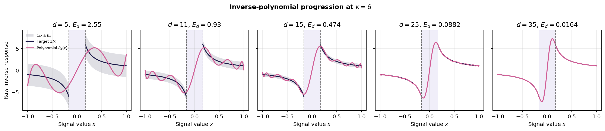
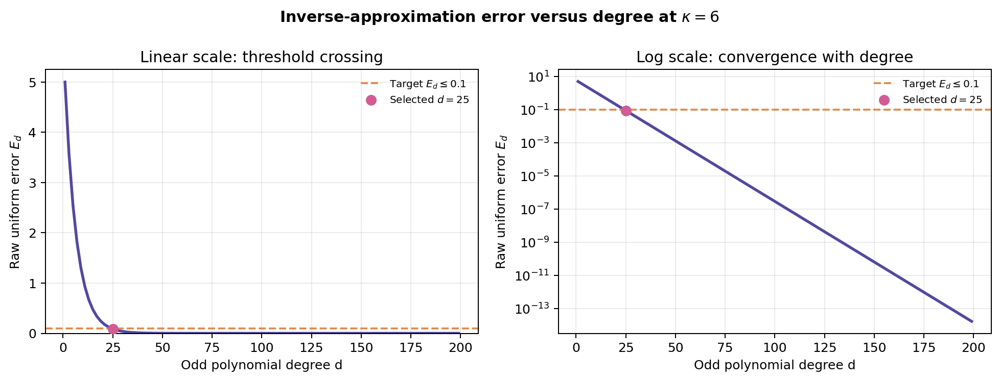
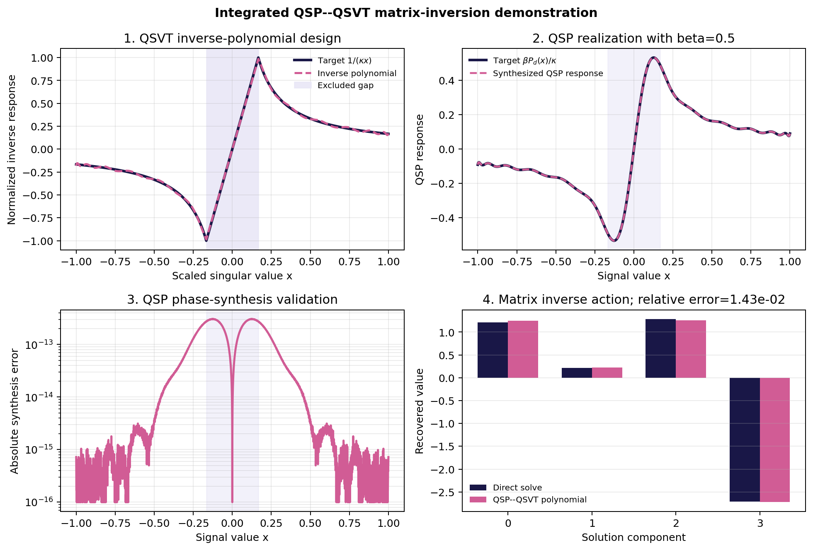
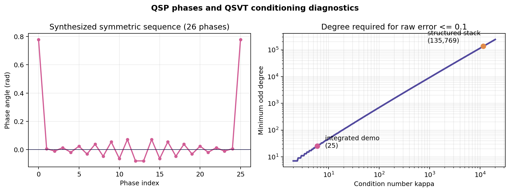

# QSP-QSVT matrix inversion: method and results

## Overview

Running [`run_qsp_qsvt_demo.py`](../scripts/run_qsp_qsvt_demo.py) performs an integrated classical validation of the two mathematical layers:

1. QSVT inverse-polynomial design for the target function $f(x)=1/x$
2. Degree-convergence analysis for the inverse approximation
3. QSP synthesis of the phase sequence that realizes that polynomial
4. Scalar validation of the synthesized response over the complete signal interval
5. Matrix-level validation of the resulting inverse action
6. A conditioning study showing how the required polynomial degree can become prohibitive.

>**NOTE:** QSP is the phase-sequence mechanism used to realize a bounded polynomial response. QSVT uses that mechanism together with a block encoding to transform the singular values of a matrix.


The calculation is classical. It synthesizes and checks the phases numerically, but it does not build a block-encoding circuit, execute QSVT on quantum hardware or claim quantum advantage.

The mathematical context is provided by the original works on [quantum signal processing](https://doi.org/10.1103/PhysRevLett.118.010501) and [quantum singular value transformation](https://arxiv.org/abs/1806.01838). The inverse-polynomial construction follows the family analysed in [Sünderhauf *et al.*](https://arxiv.org/abs/2507.15537).

## 1. From matrix inversion to a polynomial problem

Assume that a matrix has been normalized so that its relevant singular values lie in

$$
\sigma\in
\left[\frac{1}{\kappa},1\right],
$$

where $\kappa$ is its condition number. Matrix inversion requires the singular-value transformation

$$
f(\sigma)=\frac{1}{\sigma}.
$$

The inverse diverges at the origin, so it cannot be approximated uniformly over the whole interval $[-1,1]$. The approximation is required only on the two-domain set

$$
\mathcal D_\kappa=
\left[-1,-\frac{1}{\kappa}\right]
\cup
\left[\frac{1}{\kappa},1\right].
$$

The central interval

$$
\left(-\frac{1}{\kappa},\frac{1}{\kappa}\right)
$$

is the **excluded singular-value gap**. A correctly normalized problem must not contain singular values in this region, except for any null-space treatment explicitly built into a larger algorithm.

Because $1/x$ is odd, the script constructs an odd Chebyshev polynomial $P_d(x)$ of odd degree $d$ such that

$$
P_d(x)\approx\frac{1}{x},
\qquad x\in\mathcal D_\kappa.
$$

For the polynomial family used here, let

$$
a=\frac{1}{\kappa},
\qquad
n=\frac{d+1}{2}.
$$

Its raw uniform error is

$$
E_d=
\frac{(1-a)^n}{a(1+a)^{n-1}}.
$$

The script chooses the smallest odd $d$ for which $E_d$ is below the requested tolerance. In the demonstration,

$$
\kappa=6,
\qquad
E_{\mathrm{target}}=0.1,
\qquad
d=25.
$$

The theoretical raw error is $8.8193\times10^{-2}$, and direct sampling gives the same value. Dividing the polynomial by $\kappa$ gives the normalized inverse response

$$
\frac{P_d(x)}{\kappa}
\approx
\frac{1}{\kappa x},
$$

whose sampled uniform error is $1.4699\times10^{-2}$.

## 2. Why the QSVT polynomial must be scaled before QSP synthesis

Approximating the target on $\mathcal D_\kappa$ is not by itself sufficient. A QSP response must also remain bounded over the **complete** signal interval $[-1,1]$, including the excluded gap where inverse accuracy is not required.

For the degree-25 polynomial,

$$
\max_{x\in[-1,1]}
\left|\frac{P_{25}(x)}{\kappa}\right|
=1.06596>1.
$$

It therefore cannot be passed unchanged to this QSP phase solver. The script introduces the explicit scaling

$$
Q_d(x)=\beta\frac{P_d(x)}{\kappa},
\qquad
\beta=0.5.
$$

After scaling,

$$
\max_{x\in[-1,1]}|Q_d(x)|=0.532980,
$$

and the $\ell_1$ norm of its odd Chebyshev coefficients is $0.889103$. These values place the target inside the conservative contraction region used by the numerical phase solver. The choice $\beta=0.5$ is a transparent feasibility margin, it is not claimed to be the optimal scaling.

The scaling does not change the desired inverse action because it is known and can be accounted for:

$$
A^{-1}
\approx
\frac{\kappa}{\beta}Q_d(A).
$$

It does, however, reduce the amplitude of the accepted component in a QSVT implementation. This creates an accuracy--success-probability trade-off and is why the script reports the implied postselection probability rather than hiding the normalization.

## 3. QSP phase synthesis

For a scalar signal $x\in[-1,1]$, the convention used by the script is

$$
W(x)=
\begin{pmatrix}
x & i\sqrt{1-x^2}\\
i\sqrt{1-x^2} & x
\end{pmatrix},
$$

and the phased sequence is

$$
U_{\boldsymbol\phi}(x)
=
e^{i\phi_0Z}
\prod_{j=1}^{d}
W(x)e^{i\phi_jZ}.
$$

The real part of the top-left entry is designed to satisfy

$$
\operatorname{Re}
\left[
\langle0|U_{\boldsymbol\phi}(x)|0\rangle
\right]
\approx Q_d(x).
$$

Since $Q_d$ has degree 25 and odd parity, the sequence contains

$$
d+1=26
$$

phases. The script uses a symmetric phase parameterization and a contraction-mapping iteration. It converges in 15 iterations with a Chebyshev-coefficient residual of $4.04\times10^{-13}$.

The resulting sequence is then evaluated independently as a product of $2\times2$ matrices over 4,001 values of $x$. Its maximum discrepancy from the requested polynomial is

$$
\max_{x\in[-1,1]}
\left|
\operatorname{Re}\langle0|U_{\boldsymbol\phi}(x)|0\rangle-Q_d(x)
\right|
=3.05\times10^{-13}.
$$

This near-floating-point error validates the **phase synthesis**. It should not be confused with the larger approximation error between the degree-25 polynomial and the exact inverse function.

The end-to-end scalar error against the scaled inverse target is

$$
\max_{x\in\mathcal D_\kappa}
\left|
\operatorname{Re}\langle0|U_{\boldsymbol\phi}(x)|0\rangle
-\frac{\beta}{\kappa x}
\right|
=7.3494\times10^{-3}.
$$

Almost all of this value is the intentional finite-degree polynomial error, not phase-synthesis error.

## 4. How QSP becomes QSVT at matrix level

QSP describes the scalar polynomial response. QSVT lifts that response to a block-encoded matrix. Informally, if

$$
A=U\Sigma V^\dagger,
$$

then a compatible QSVT sequence applies the designed polynomial to the singular values in $\Sigma$, with the precise left/right singular-vector structure determined by the polynomial parity and circuit convention.

The present script does not construct that block encoding. Instead, it checks the expected spectral action directly on a small symmetric positive-definite matrix, for which the singular values and eigenvalues coincide:

$$
A=V\operatorname{diag}
\left(1,0.7,0.35,\frac16\right)V^T,
\qquad
\kappa(A)=6.
$$

The synthesized scalar response is applied to each eigenvalue:

$$
Q_d(A)
=
V\operatorname{diag}
\left(Q_d(\lambda_1),\ldots,Q_d(\lambda_4)\right)V^T.
$$

This operator is compared with

$$
\frac{\beta}{\kappa}A^{-1}.
$$

For a fixed right-hand side $\mathbf b$, the recovered solution is

$$
\mathbf x_{\mathrm{poly}}
=
\frac{\kappa}{\beta}Q_d(A)\mathbf b,
$$

and the exact reference is

$$
\mathbf x_{\mathrm{exact}}=A^{-1}\mathbf b.
$$

This is a classical, matrix-level check that connects the synthesized QSP polynomial to the matrix function QSVT is intended to implement. It is not a substitute for building and validating the block-encoding circuit.

## 5. Results

All values reported below are generated by the script and recorded in [`qsp_qsvt_metrics.json`](../results/qsp_qsvt_metrics.json).

### 5.1 Inverse-polynomial design

| Quantity | Value | Interpretation |
| --- | ---: | --- |
| Condition number $\kappa$ | `6` | Relevant normalized singular values lie in $[1/6,1]$. |
| Requested raw uniform error | `0.1` | Degree-selection threshold for approximating $1/x$. |
| Polynomial degree | `25` | Smallest odd degree returned by the analytic error expression. |
| Theoretical raw error | `8.8193e-2` | Analytic bound/value for this polynomial family. |
| Sampled raw error | `8.8193e-2` | Maximum sampled \|$P_d(x)-1/x$\| on $\mathcal D_\kappa$. |
| Sampled normalized error | `1.4699e-2` | Maximum sampled error after division by $\kappa$. |
| Unscaled maximum on $[-1,1]$ | `1.06596` | Shows why additional QSP scaling is required. |

### 5.2 Polynomial-degree progression and convergence

The degree-25 result is part of a systematic degree study rather than an isolated polynomial fit. For the fixed condition number $\kappa=6$, the script evaluates the same analytic polynomial family at several odd degrees:

| Odd degree $d$ | Raw uniform error $E_d$ |
| ---: | ---: |
| `5` | `2.5510` |
| `11` | `9.2967e-1` |
| `15` | `4.7432e-1` |
| `25` | `8.8193e-2` |
| `35` | `1.6398e-2` |



Each panel compares the raw polynomial $P_d(x)$ with $1/x$. The vertical dashed lines mark the boundaries

$$
x=\pm\frac{1}{\kappa}=\pm\frac16,
$$

and the central shaded area is the excluded singular-value gap. The grey bands show the uniform-error envelope

$$
\frac{1}{x}-E_d
\leq
P_d(x)
\leq
\frac{1}{x}+E_d
$$

on the valid approximation domain $\mathcal D_\kappa$.

At low degree, the polynomial exhibits large oscillations and only a coarse approximation to the inverse. Increasing the degree progressively brings it towards $1/x$ on both valid branches. Its behavior inside the excluded gap is not an inverse-approximation error: no singular value of the normalized test problem is assumed to lie there, and the approximation condition is imposed only on $\mathcal D_\kappa$.



The left panel displays $E_d$ on a linear scale, making the rapid initial reduction and the target crossing visible. The right panel shows the same values on a logarithmic scale, revealing the continued convergence that is compressed near zero in the linear plot. Only odd degrees are included because the inverse target has odd parity.

The horizontal dashed line is the requested raw-error threshold $E_d\leq0.1$. The marked point $d=25$ is the smallest odd degree satisfying that requirement:

$$
E_{23}>0.1,
\qquad
E_{25}=0.0881929<0.1.
$$

Degree 35 would reduce the raw error to approximately $0.0164$, but it would also require ten additional QSP signal queries and phase rotations. Degree 25 is therefore selected by the declared tolerance before phase synthesis, rather than chosen retrospectively from the final matrix result.


### 5.3 Phase synthesis and scalar validation

| Quantity | Value | Interpretation |
| --- | ---: | --- |
| Scaling $\beta$ | `0.5` | Conservative amplitude margin used before phase synthesis. |
| Maximum scaled response | `0.532980` | The target remains bounded over the complete QSP interval. |
| Odd-coefficient $\ell_1$ norm | `0.889103` | Places the target inside the solver's conservative contraction region. |
| Number of phases | `26` | One more phase than the degree-25 polynomial. |
| Solver iterations | `15` | Contraction iterations needed to reach the tolerance. |
| Coefficient residual | `4.04e-13` | Residual in the phase-synthesis iteration. |
| QSP response vs polynomial | `3.05e-13` | Independent maximum response error over $[-1,1]$. |
| QSP response vs scaled inverse | `7.3494e-3` | Total scalar error, dominated by polynomial approximation. |



The four panels show successive validation layers:

1. **Inverse-polynomial design.** The dark curve is $1/(\kappa x)$ and the dashed curve is $P_{25}(x)/\kappa$. Agreement is assessed only outside the shaded singular-value gap $|x|<1/\kappa$.
2. **QSP realization.** The complete synthesized response is compared with $Q_{25}(x)=\beta P_{25}(x)/\kappa$ on all of $[-1,1]$. This full-domain check is essential because QSP boundedness cannot be assessed only on the inverse-approximation domain.
3. **Phase-synthesis error.** The difference between the $2\times2$ QSP sequence and its polynomial target remains at approximately $10^{-13}$ or below. This panel validates the phases, not the approximation to $1/x$.
4. **Matrix inverse action.** The panel compares the four entries of the solution vector obtained from the polynomial inverse,

$$
\mathbf x_{\mathrm{poly}}
=
\frac{\kappa}{\beta}Q_d(A)\mathbf b,
$$

with the exact reference $\mathbf x_{\mathrm{exact}}=A^{-1}\mathbf b$ obtained from a direct dense solve. The indices $0,\ldots,3$ label the entries of these four-dimensional vectors, they do not represent physical variables or singular values. Their visible difference is caused by the finite-degree approximation of $1/x$.
### 5.4 Matrix-level inverse action and postselection

| Metric | Value | Interpretation |
| --- | ---: | --- |
| Operator relative Frobenius error | `2.1698e-2` (`2.17%`) | Error in $Q_d(A)$ relative to $(\beta/\kappa)A^{-1}$. |
| Solution relative $\ell_2$ error | `1.4292e-2` (`1.43%`) | Error in the recovered solution for the selected right-hand side. |
| Linear-system relative residual | `8.0328e-3` (`0.803%`) | Relative size of $A\mathbf x_{\mathrm{poly}}-\mathbf b$. |
| Implied postselection probability | `2.1793e-2` (`2.18%`) | Squared norm of $Q_d(A)|b\rangle$ for the normalized test input. |
| Ideal scaled-inverse probability | `2.1689e-2` (`2.17%`) | Probability obtained from the exact scaled operator $(\beta/\kappa)A^{-1}$. |

The three error rows measure different objects and therefore need not have the same value. The operator metric weights all matrix directions through the Frobenius norm, the solution error weights only the directions present in the chosen $\mathbf b$, and the residual additionally multiplies the solution error by $A$.

The probability is **input dependent**. It is the ideal ancilla-acceptance probability implied by the polynomial block for this normalized right-hand side, assuming a compatible exact block encoding. It is not a measured hardware success rate. Its proximity to the ideal scaled-inverse value shows that the finite-degree polynomial reproduces the expected accepted amplitude for this test, while its small absolute value exposes the cost of the conservative scaling.

### 5.5 Phase sequence and conditioning diagnostic



The left panel shows the 26 synthesized phases. Their mirror symmetry follows from the real, odd target-polynomial parameterization. The phase values are also stored explicitly in the metrics JSON so the numerical result can be inspected without reading values from the plot.

The right panel shows the minimum odd degree predicted by this specific inverse-polynomial family as $\kappa$ increases while the raw-error target remains fixed at $0.1$. It is a diagnostic for this construction, not a universal lower bound for every possible quantum linear-system algorithm.

The integrated demonstration uses $\kappa=6$ and degree 25. The script also constructs a separate $40\times40$ time-stacked linear system from a state--costate propagator. After normalization by its largest singular value, it has

$$
\sigma_{\min}=0.00429753,
\qquad
\sigma_{\max}=50.0201,
\qquad
\kappa=11639.3.
$$

At the same raw-error target, the degree estimate becomes

$$
d=135\,769.
$$

The script deliberately does not synthesize that phase sequence. The large degree is a negative but useful result: direct inversion of a poorly conditioned formulation would be impractical in this model. A credible application would need preconditioning, a better-conditioned formulation, a different approximation strategy or an explicit decision not to use QSVT inversion in that regime.


## 6. Demonstrated capabilities
The demonstration provides concrete evidence that the team can:

- Construct and validate an odd Chebyshev approximation to an inverse function
- Enforce parity, full-domain boundedness and scaling conditions before phase synthesis
- Synthesize and independently validate a nontrivial QSP phase sequence
- Connect the scalar QSP response to the spectral matrix transformation used by QSVT
- Distinguish approximation, phase-synthesis, solution and residual errors
- Quantify conditioning and postselection as potential implementation bottlenecks.

These capabilities provide relevant foundations for assessing QSP/QSVT-based linear-algebra and matrix-function primitives that may be required in an Airbus proof of concept.


## 7. Reproduction

From the repository root, the recommended reproducible workflow is:

```bash
uv sync --locked
uv run python scripts/run_qsp_qsvt_demo.py
```

The script writes:

- [`qsp_qsvt_metrics.json`](../results/qsp_qsvt_metrics.json), containing parameters, software versions, phases and numerical errors
- [`qsp_qsvt_pipeline.png`](../results/qsp_qsvt_pipeline.png), containing the four end-to-end validation panels
- [`qsp_qsvt_resources.png`](../results/qsp_qsvt_resources.png), containing the phase sequence and conditioning diagnostic
- [`qsp_qsvt_inverse_polynomial_progression.png`](../results/qsp_qsvt_inverse_polynomial_progression.png), comparing five approximation degrees
- [`qsp_qsvt_degree_convergence.png`](../results/qsp_qsvt_degree_convergence.png), showing error decay and the degree-selection threshold.


