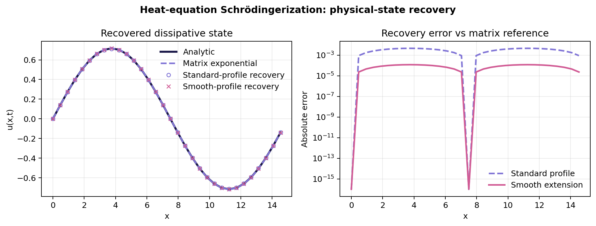
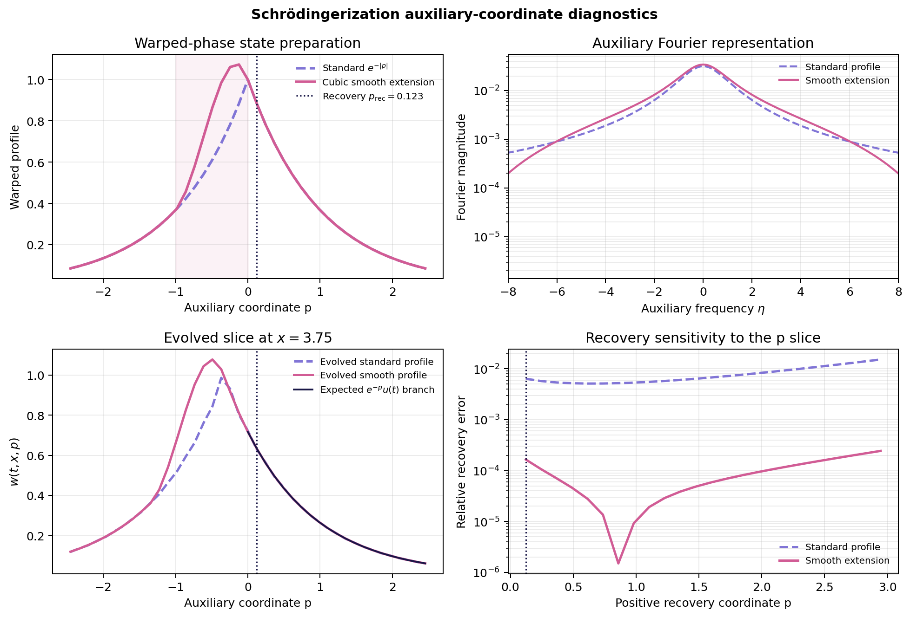
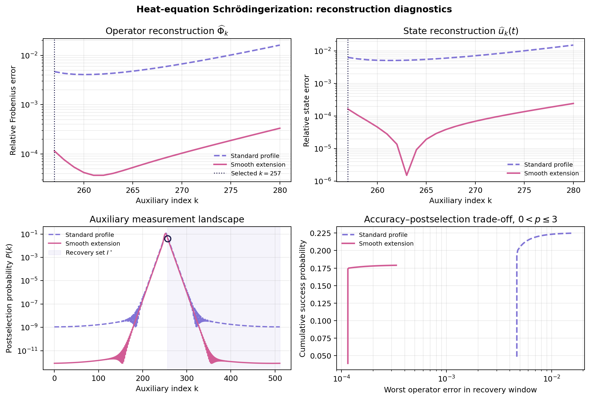

# Heat-equation Schrödingerization: method and results

## Overview

Running [`run_heat_equation_demo.py`](../scripts/run_heat_equation_demo.py) performs an end-to-end classical simulation of Schrödingerization for a one-dimensional periodic heat equation. The script:

1. Discretizes the dissipative heat operator
2. Introduces and discretizes the warped auxiliary coordinate
3. Evolves the corresponding enlarged Hermitian system
4. Recovers both the physical state and the complete spatial propagator 
5. Validates the reconstruction and its postselection probabilities

The calculation produces a metrics file and three figures in [`results/`](../results/). It is evidence of the mathematical construction and numerical validation workflow, not a quantum-hardware experiment or a claim of quantum advantage.

The formulation follows the warped-phase Schrödingerization method described by [Jin, Liu and Yu](https://doi.org/10.1103/PhysRevA.108.032603).

### Results at a glance

The headline results are evaluated at the predetermined recovery coordinate

$$
k_{\mathrm{rec}}=257,
\qquad
p_{\mathrm{rec}}=0.122718.
$$

| Result | Standard profile | Smooth extension |
| --- | ---: | ---: |
| State recovery error vs matrix exponential | `0.638%` | `0.0165%` |
| Operator reconstruction error at $k=257$ | `0.467%` | `0.0115%` |
| Success probability over $p\ge0$ | `28.9%` | `22.9%` |

The smooth extension reduces the operator reconstruction error by a factor of approximately $40.6$, at the cost of reducing the accepted probability from $28.9\%$ to $22.9\%$.

These values summarize the central numerical result. The following sections explain the construction, validation references and accuracy--postselection trade-off in detail.

## 1. Problem definition

The demonstration solves the one-dimensional heat equation with periodic boundary conditions:

$$
\frac{\partial u(x,t)}{\partial t}
=
\alpha\frac{\partial^2u(x,t)}{\partial x^2},
\qquad
x\in[0,L),
$$

$$
u(x,0)=\sin\left(\frac{2\pi x}{L}\right),
\qquad
u(0,t)=u(L,t).
$$

The experiment uses:

| Parameter | Value | Meaning |
| --- | ---: | --- |
| $L$ | $15$ | Length of the periodic spatial domain. |
| $\alpha$ | $L/(2\pi)^2\approx0.379954$ | Diffusivity. |
| $t$ | $5$ | Final evolution time. |
| $N_x$ | $32=2^5$ | Number of spatial grid points (5 qubits). |
| $N_p$ | $512=2^9$ | Number of auxiliary grid points (9 qubits). |
| $R$ | $10$ | Auxiliary-domain scale, with $p\in[-R\pi,R\pi)$. |

For this initial Fourier mode, the continuous analytical solution is

$$
u_{\mathrm{exact}}(x,t)
=
\exp\left[-\alpha\left(\frac{2\pi}{L}\right)^2t\right]
\sin\left(\frac{2\pi x}{L}\right)
=
\exp\left(-\frac{t}{L}\right)
\sin\left(\frac{2\pi x}{L}\right).
$$

This closed-form solution provides an exact reference against which the numerical experiment can be validated.

## 2. Schrödingerization construction

### 2.1 Spatial discretization

The periodic second derivative is approximated by

$$
(D_{xx}\mathbf u)_m
=
\frac{u_{m-1}-2u_m+u_{m+1}}{\Delta x^2},
\qquad
\Delta x=\frac{L}{N_x},
$$

where the indices are taken modulo $N_x$ to impose periodicity. The semi-discrete equation is

$$
\frac{d\mathbf u}{dt}=A\mathbf u,
\qquad
A=\alpha D_{xx},
$$

with propagator

$$
\Phi(t)=e^{At}.
$$

$D_{xx}$ is real symmetric and negative semidefinite. Consequently, $A$ is Hermitian but generates a dissipative semigroup rather than a unitary evolution.

For a general complex generator, the starting point is the Hermitian decomposition

$$
A=A_1+iA_2,
\qquad
A_1=\frac{A+A^\dagger}{2},
\qquad
A_2=\frac{A-A^\dagger}{2i}.
$$

For this heat operator,

$$
A_1=A,
\qquad
A_2=0.
$$

The example therefore isolates the auxiliary-coordinate construction without an additional anti-Hermitian component.

### 2.2 Warped-phase transformation

For $p>0$, introduce the auxiliary coordinate $p$ and define

$$
\mathbf w(t,p)=e^{-p}\mathbf u(t).
$$

Because $\partial_p\mathbf w=-\mathbf w$, the dissipative equation becomes

$$
\frac{\partial\mathbf w}{\partial t}
+A\frac{\partial\mathbf w}{\partial p}=0.
$$

Thus the original decay in physical time is represented as transport along the auxiliary coordinate. Once $\mathbf w(t,p)$ has been evolved, the physical state can be decoded on the positive branch through

$$
\mathbf u(t)=e^p\mathbf w(t,p).
$$

### 2.3 Auxiliary extensions

Fourier discretization requires initial data over the complete auxiliary interval. The standard symmetric extension is

$$
g_1(p)=e^{-|p|},
\qquad
\mathbf w(0,p)=g_1(p)\mathbf u(0).
$$

$g_1$ has a cusp at $p=0$, which produces a slowly decaying high-frequency tail. The script therefore also evaluates the smooth extension

$$
g_2(p)=
\begin{cases}
e^{-|p|}, & p\notin(-1,0),\\[4pt]
\left(\dfrac{3}{e}-3\right)p^3
+\left(\dfrac{4}{e}-5\right)p^2-p+1,
& -1<p<0.
\end{cases}
$$

The cubic matches both the value and first derivative of the surrounding branches at $p=-1$ and $p=0$. It removes the cusp while leaving the entire physical branch $p\ge0$ equal to $e^{-p}$.

This comparison tests how auxiliary-state regularity affects spectral truncation, reconstruction error and postselection probability.

### 2.4 Auxiliary grid and state preparation

The auxiliary interval is sampled at

$$
p_k=-R\pi+k\Delta p,
\qquad
\Delta p=\frac{2R\pi}{N_p},
\qquad
k=0,\ldots,N_p-1.
$$

For either profile $g_r$, define

$$
C_g=\left(\sum_{k=0}^{N_p-1}|g_r(p_k)|^2\right)^{1/2},
\qquad
c_k=\frac{g_r(p_k)}{C_g}.
$$

The normalized auxiliary state is

$$
|g_r\rangle=\sum_{k=0}^{N_p-1}c_k|p_k\rangle,
$$

and an abstract state-preparation unitary satisfies

$$
U_g|0\rangle=|g_r\rangle.
$$

The script constructs these amplitudes numerically. It does not synthesize a gate-level implementation of $U_g$.

### 2.5 Fourier representation and enlarged Hamiltonian

Using the unitary discrete Fourier transform

$$
F_p|p_k\rangle
=
\frac{1}{\sqrt{N_p}}
\sum_{j=0}^{N_p-1}
e^{2\pi i jk/N_p}|\eta_j\rangle,
$$

the derivative in $p$ becomes multiplication by a real frequency:

$$
F_p[\partial_p\mathbf w]
=
-iD_\eta\widetilde{\mathbf w},
\qquad
D_\eta=\operatorname{diag}(\eta_0,\ldots,\eta_{N_p-1}).
$$

The script uses FFT ordering,

$$
\eta_j=
\begin{cases}
j/R, & 0\le j<N_p/2,\\[4pt]
(j-N_p)/R, & N_p/2\le j<N_p.
\end{cases}
$$

Transforming the transport equation gives

$$
i\frac{\partial\widetilde{\mathbf w}}{\partial t}
=
H_{\mathrm{Sch}}\widetilde{\mathbf w},
\qquad
H_{\mathrm{Sch}}=-A\otimes D_\eta.
$$

Both $A$ and $D_\eta$ are Hermitian, so $H_{\mathrm{Sch}}$ is Hermitian and

$$
U_H(t)=e^{-iH_{\mathrm{Sch}}t}
$$

is unitary. The sign shown here follows from the positive exponent used in the definition of $F_p$; changing the Fourier convention changes the displayed sign but not the construction.

The enlarged state has dimension

$$
N_xN_p=32\times512=16{,}384,
$$

corresponding to 5 spatial and 9 auxiliary index qubits before any state-preparation or Hamiltonian-simulation ancillas.

### 2.6 Complete register-level operation

Using the register order $\mathcal H_x\otimes\mathcal H_p$, the complete operation is

$$
U_{\mathrm{Sch}}(t)
=
(I_x\otimes F_p^\dagger)
e^{-iH_{\mathrm{Sch}}t}
(I_x\otimes F_p)
(I_x\otimes U_g).
$$

It represents the following sequence:

1. Prepare the auxiliary profile with $U_g$
2. Apply the QFT from $p$ to $\eta$
3. Evolve under the enlarged Hermitian Hamiltonian
4. Apply the inverse QFT to return to the $p$ basis

For a normalized physical input,

$$
U_{\mathrm{Sch}}(t)
\left(|u_0\rangle\otimes|0\rangle\right)
=
\sum_{k=0}^{N_p-1}
\mathcal B_k(t)|u_0\rangle\otimes|p_k\rangle,
$$

where

$$
\mathcal B_k(t)
=
(I_x\otimes\langle p_k|)
U_{\mathrm{Sch}}(t)
(I_x\otimes|0\rangle)
$$

is the normalized physical-system block associated with auxiliary outcome $k$.

The script evaluates the matrix-level equivalent of this sequence classically. It validates the construction but does not implement $U_g$, the QFT or Hamiltonian simulation as quantum gates.

### 2.7 State and operator recovery

Within a valid positive-$p$ recovery region, the ideal warped solution implies

$$
\mathcal B_k(t)\approx c_k\Phi(t).
$$

For numerical convenience, the script evolves the unnormalized profile and stores blocks

$$
B_k=C_g\mathcal B_k.
$$

Since $g_r(p_k)=C_gc_k$, the complete spatial propagator and the selected physical state are reconstructed as

$$
\widehat\Phi_k(t)
=
\frac{B_k(t)}{g_r(p_k)}
\approx
\Phi(t),
$$

$$
\widehat{\mathbf u}_k(t)
=
\frac{B_k(t)\mathbf u(0)}{g_r(p_k)}
\approx
\Phi(t)\mathbf u(0).
$$

The script reports both state- and operator-level errors:

$$
\varepsilon_{\mathrm{state}}(k)
=
\frac{\|\widehat{\mathbf u}_k-\Phi\mathbf u(0)\|_2}
{\|\Phi\mathbf u(0)\|_2},
$$

$$
\varepsilon_{\mathrm{op}}(k)
=
\frac{\|\widehat\Phi_k-\Phi\|_F}{\|\Phi\|_F}.
$$

The state error probes the selected sine-wave input. The Frobenius error evaluates all matrix entries and is therefore a broader, input-independent diagnostic, although it is not a worst-case operator-norm bound.

### 2.8 Postselection probability

For normalized $|u_0\rangle$, the Born probability of observing auxiliary index $k$ is

$$
P(k\mid u_0)
=
\|\mathcal B_k(t)|u_0\rangle\|_2^2
=
\frac{\|B_k(t)|u_0\rangle\|_2^2}{C_g^2},
\qquad
\sum_kP(k\mid u_0)=1.
$$

The recovery threshold is

$$
p_*=t\max\!\left(0,\lambda_{\max}(A_1)\right).
$$

For the periodic heat operator, $A_1=A\preceq0$, so $p_*=0$ and

$$
\mathcal I_*=\{k:p_k\ge0\}.
$$

The total success probability is

$$
P_{\mathrm{rec}}
=
\sum_{k\in\mathcal I_*}P(k\mid u_0).
$$

In the ideal recovery regime,

$$
P_{\mathrm{rec}}
\approx
\left(\sum_{k\in\mathcal I_*}|c_k|^2\right)
\frac{\|\Phi(t)u_0\|_2^2}{\|u_0\|_2^2}.
$$

The first factor is the auxiliary-profile mass in the accepted region; the second reflects contraction of the dissipative physical evolution. Smoothing the profile can therefore improve spectral accuracy while reducing the probability of accepting a measurement outcome.

### 2.9 Efficient classical evaluation

The state-level path applies the sparse enlarged exponential to a vector with `scipy.sparse.linalg.expm_multiply` (it doesn't construct a dense $16{,}384\times16{,}384$ exponential).

The operator-level path additionally exploits separability. If

$$
A=V\Lambda V^\dagger,
$$

then every auxiliary frequency defines a small spatial propagator

$$
U_j(t)
=
e^{i\eta_jAt}
=
V\operatorname{diag}
\left(e^{i\eta_j\lambda_0t},\ldots,
e^{i\eta_j\lambda_{N_x-1}t}\right)V^\dagger.
$$

Under unitary FFT normalization, if $\widetilde g=F_pg$, the unnormalized output blocks are

$$
B_k(t)
=
\sum_{j=0}^{N_p-1}
(F_p^\dagger)_{kj}\widetilde g_jU_j(t).
$$

This identity allows all operator slices to be reconstructed using FFTs and $N_x\times N_x$ eigendecompositions. The independent state-level and operator-level paths are later compared as an internal consistency check.


## 3. Results

All values reported below are generated by the script and recorded in [`heat_equation_metrics.json`](../results/heat_equation_metrics.json).

The recovery coordinate is determined from the spectrum of the discretized physical generator

$$
A=\alpha D_{xx}.
$$

The theoretically admissible recovery region starts at

$$
p_*
=
t\max\left(0,\lambda_{\max}(A)\right).
$$

Because the periodic finite-difference Laplacian is negative semidefinite,

$$
\lambda_{\max}(A)=0,
\qquad
p_*=0.
$$

Therefore, the physical solution can be recovered from the non-negative auxiliary branch. The auxiliary grid is

$$
p_k
=
\left(k-\frac{N_p}{2}\right)\Delta p,
\qquad
\Delta p
=
\frac{2R\pi}{N_p}.
$$

For $R=10$ and $N_p=512$,

$$
\Delta p
=
\frac{20\pi}{512}
=
0.122718.
$$

The central index $k=256$ corresponds exactly to $p=0$. The demonstration instead uses the first strictly positive point,

$$
k_{\mathrm{rec}}=257,
\qquad
p_{\mathrm{rec}}=\Delta p=0.122718.
$$

This choice is deliberate. It places the recovery point unambiguously inside the physical branch $p>0$, avoids decoding exactly at the joining point of the auxiliary extension—where the standard profile $e^{-|p|}$ has a cusp—and remains as close as possible to zero. Staying close to zero also limits numerical error amplification because recovery requires division by

$$
g(p_{\mathrm{rec}})=e^{-p_{\mathrm{rec}}},
$$

or equivalently multiplication by $e^{p_{\mathrm{rec}}}$.

The index is fixed before evaluating the reconstruction-error sweep and is used for both auxiliary profiles. It is therefore a common, theoretically justified reference point rather than an a posteriori selection of the coordinate producing the smallest error.

### 3.1 Physical-state recovery

The table reports three complementary comparisons:

1. **Recovery vs analytical solution** measures the total discrepancy between the recovered state and the continuous heat-equation solution. It includes both spatial-discretization and Schrödingerization-recovery effects.

2. **Recovery vs matrix exponential** compares the recovered state with the direct evolution of the same finite-difference operator. It therefore isolates the error introduced by the auxiliary discretization and recovery procedure.

3. **Matrix exponential vs analytical solution** compares the discretized evolution with the continuous solution. This provides the spatial-discretization baseline and does not depend on the auxiliary profile.

Together, these comparisons separate the error chain

$$
\mathbf u_{\mathrm{exact}}
\longrightarrow
\mathbf u_{\mathrm{matrix}}
\longrightarrow
\mathbf u_{\mathrm{recovered}}.
$$

All values are relative Euclidean errors:

$$
\varepsilon_2
=
\frac{
\|\mathbf u_{\mathrm{numerical}}-\mathbf u_{\mathrm{reference}}\|_2
}{
\|\mathbf u_{\mathrm{reference}}\|_2
}.
$$

| Metric | Standard $e^{-\|p\|}$ | Smooth extension |
| --- | ---: | ---: |
| Recovery vs analytical solution | `5.3158e-3` (`0.532%`) | `9.0461e-4` (`0.0905%`) |
| Recovery vs matrix exponential | `6.3790e-3` (`0.638%`) | `1.6533e-4` (`0.0165%`) |
| Matrix exponential vs analytical solution | `1.0701e-3` (`0.107%`) | `1.0701e-3` (`0.107%`) |


The error relative to the matrix exponential is the most direct measure of the Schrödingerization recovery. At the fixed coordinate $p_{\mathrm{rec}}=0.122718$, the standard profile produces an error of `0.638%`, while the smooth extension reduces it to `0.0165%`. The improvement factor is

$$
\frac{6.3790\times10^{-3}}
{1.6533\times10^{-4}}
\approx 38.6.
$$

This improvement is attributed to the smoother negative-$p$ extension, whose Fourier coefficients decay more rapidly. Both profiles retain the same physical branch, $g(p)=e^{-p}$ for $p\ge0$, and are decoded at the same auxiliary coordinate.



The left panel compares the four physical-space solutions:

- the analytical continuous solution;
- the direct matrix-exponential solution;
- the state recovered with the standard profile; and
- the state recovered with the smooth profile.

The initial sine mode retains its spatial shape while its amplitude decays. For the selected parameters,

$$
e^{-t/L}=e^{-5/15}\approx0.7165,
$$

which explains the maximum recovered amplitude of approximately $0.716$. All four curves overlap at the scale of the physical solution, showing that both Schrödingerized evolutions reproduce the expected dissipative behavior.

The right panel magnifies the differences by plotting the pointwise absolute recovery error relative to the matrix reference:

$$
\left|
u_{\mathrm{recovered}}(x_j,t)
-
u_{\mathrm{matrix}}(x_j,t)
\right|.
$$

Unlike the table, which reports a global relative $L_2$ error, this panel shows an absolute error at every spatial grid point. The smooth-profile curve lies consistently below the standard-profile curve, demonstrating that the improvement is distributed across the spatial domain rather than being confined to a single point.

The sharp decreases near $x=0$ and $x=L/2=7.5$ occur at the nodes of the sine mode, where the analytical, matrix-reference and recovered states are all approximately zero. The remaining differences there are at floating-point precision, around $10^{-16}$.

Finally, the smooth-profile error relative to the analytical solution (`0.0905%`) is slightly smaller than the standalone spatial-discretization error (`0.107%`). This does not mean that smoothing removes the finite-difference error. If

$$
\mathbf e_{\mathrm{space}}
=
\mathbf u_{\mathrm{matrix}}-\mathbf u_{\mathrm{exact}}
$$

and

$$
\mathbf e_{\mathrm{Sch}}
=
\mathbf u_{\mathrm{recovered}}-\mathbf u_{\mathrm{matrix}},
$$

then the total error is

$$
\mathbf e_{\mathrm{total}}
=
\mathbf e_{\mathrm{space}}+\mathbf e_{\mathrm{Sch}}.
$$

The norms of these error vectors do not add arithmetically. In this experiment they partially cancel, making the total analytical error slightly smaller than the spatial-discretization error alone. This cancellation is specific to the selected numerical configuration and should not be interpreted as a general accuracy guarantee.

### 3.2 Auxiliary-coordinate diagnostics

The following figure examines how the auxiliary profile is prepared, represented in the Fourier basis, evolved and finally decoded. Reading the four panels from left to right and top to bottom gives the complete auxiliary-coordinate workflow.



**Top left — Warped-phase state preparation.**

The dashed curve is the standard symmetric profile

$$
g_1(p)=e^{-|p|}.
$$

The solid curve is the smooth extension $g_2(p)$. Both profiles are identical for $p\le-1$ and throughout the physical branch $p\ge0$. They differ only inside the shaded interval $-1<p<0$, where the standard profile is replaced by a cubic polynomial.

The standard profile has a cusp at $p=0$: its left and right derivatives are different. The cubic bridge matches the value and first derivative at both endpoints of the modified interval, making the profile continuously differentiable. The slight overshoot above one on the negative branch is a consequence of satisfying these matching conditions, it does not modify the physical branch used for recovery.

The dotted vertical line marks the fixed recovery coordinate

$$
p_{\mathrm{rec}}=0.122718.
$$

At this coordinate, both profiles have exactly the same value because they coincide for every $p\ge0$.

**Top right — Auxiliary Fourier representation.**

Schrödingerization applies a Fourier transform in the auxiliary coordinate, so the regularity of $g(p)$ determines how efficiently it can be represented on a finite frequency grid.

The panel shows the magnitudes of the discrete Fourier coefficients,

$$
|\widetilde g(\eta_j)|.
$$

Removing the cusp redistributes the spectral weight and produces a faster-decaying asymptotic tail. The smooth profile is not required to have smaller coefficients at every intermediate frequency, the relevant effect is the reduction of the highest-frequency components, which are the most difficult to represent on a finite auxiliary grid.

This provides the mechanism behind the improved reconstruction: with the same $N_p=512$ frequency modes, the smooth extension suffers less Fourier truncation and aliasing error.

**Bottom left — Evolved auxiliary slice.**

This panel shows $w(t,x,p)$ at

$$
x=3.75=\frac{L}{4},
$$

where the initial sine mode reaches its positive maximum. Choosing a nonzero, high-amplitude spatial point makes the auxiliary evolution easy to inspect.

The dashed and solid curves are obtained by evolving the standard and smooth profiles through the enlarged Hermitian system. The dark reference curve is the expected positive branch,

$$
w_{\mathrm{expected}}(t,x,p)
=
e^{-p}u_{\mathrm{matrix}}(t,x),
\qquad p\ge0.
$$

Although the profiles evolve differently for negative $p$, both should reproduce this same physical branch for positive $p$. Near the marked recovery coordinate, the evolved curves closely follow the expected exponential branch.

The physical value is recovered by removing the known warp factor:

$$
u_{\mathrm{recovered}}(t,x)
=
\frac{w(t,x,p_{\mathrm{rec}})}
{e^{-p_{\mathrm{rec}}}}
=
e^{p_{\mathrm{rec}}}w(t,x,p_{\mathrm{rec}}).
$$

The panel therefore checks the warped quantity before division, while the physical-state figure checks the final decoded solution.

**Bottom right — Sensitivity to the recovery coordinate.**

The final panel repeats the recovery for each displayed positive auxiliary coordinate and reports

$$
\varepsilon_{\mathrm{state}}(p_k)
=
\frac{
\left\|
\operatorname{Re}\!\left[
\mathbf w(t,p_k)/g(p_k)
\right]
-
\mathbf u_{\mathrm{matrix}}(t)
\right\|_2
}{
\|\mathbf u_{\mathrm{matrix}}(t)\|_2
}.
$$

At the fixed coordinate marked by the dotted line, the errors agree with the values reported in the physical-state table:

$$
\varepsilon_{\mathrm{standard}}
=
6.3790\times10^{-3},
$$

$$
\varepsilon_{\mathrm{smooth}}
=
1.6533\times10^{-4}.
$$

The smooth extension remains substantially more accurate across the displayed positive-$p$ interval and reaches errors close to $10^{-6}$ at some coordinates. These minima are shown only as sensitivity diagnostics; they are not used to select the headline recovery point.

For larger values of $p$, the warp factor $g(p)=e^{-p}$ becomes smaller. Recovery then requires multiplication by $e^p$, which amplifies residual Fourier, truncation and floating-point errors. This explains the eventual increase in both curves.

Taken together, the panels show the complete cause-and-effect chain:

$$
\text{profile regularity}
\longrightarrow
\text{Fourier representation}
\longrightarrow
\text{evolved positive branch}
\longrightarrow
\text{recovery accuracy}.
$$

The auxiliary extension is therefore not merely a plotting choice. It directly controls the spectral accuracy of the finite-dimensional Schrödingerization and influences the reliability of the recovered physical state.

### 3.3 Operator reconstruction and postselection

Recovering the sine-wave state verifies the method for one particular initial condition. A broader, input-independent test is to reconstruct the complete discretized propagator

$$
\Phi(t)=e^{\alpha D_{xx}t},
$$

which determines the evolution of any spatial input.

For every auxiliary outcome $k$, the Schrödingerized evolution produces a spatial block $B_k(t)$. The corresponding approximation to the dissipative propagator is

$$
\widehat{\Phi}_k(t)
=
\frac{B_k(t)}{g(p_k)}.
$$

Its error is measured with the relative Frobenius norm

$$
\varepsilon_{\mathrm{op}}(k)
=
\frac{
\|\widehat{\Phi}_k(t)-\Phi(t)\|_F
}{
\|\Phi(t)\|_F
}.
$$

Unlike the state-recovery error, this metric compares every matrix element of the reconstructed propagator. It is therefore independent of the selected sine-wave input and tests whether the method recovers the complete linear evolution.

| Quantity | Standard profile | Smooth extension |
| --- | ---: | ---: |
| Relative Frobenius error at $k=257$ | `4.6687e-3` (`0.467%`) | `1.1510e-4` (`0.0115%`) |
| Best operator error shown for $0<p\le3$ | `4.0692e-3` at $p=0.490874$ | `3.6967e-5` at $p=0.613592$ |
| Probability of the selected outcome $k=257$ | `0.048527` (`4.85%`) | `0.039054` (`3.91%`) |
| Success probability over the complete region $p\ge0$ | `0.289260` (`28.9%`) | `0.229458` (`22.9%`) |
| Sum of all auxiliary probabilities | `1.000000` | `1.000000` |

At the fixed recovery index, the smooth extension reduces the operator-level error by

$$
\frac{4.6687\times10^{-3}}
{1.1510\times10^{-4}}
\approx 40.6.
$$

This improvement is consistent with the state-level results, but it is a broader statement: the smooth profile improves the reconstruction of the complete propagator, not only its action on the selected initial state. The Frobenius metric nevertheless remains an aggregate matrix error rather than a worst-case operator-norm bound.



The four panels separate reconstruction accuracy from measurement probability.

**Top left — Operator reconstruction error.**

This panel shows $\varepsilon_{\mathrm{op}}(k)$ over the displayed positive auxiliary interval. The horizontal coordinate is the auxiliary index, related to the physical coordinate by

$$
p_k=(k-256)\Delta p,
\qquad
\Delta p=0.122718.
$$

Therefore, the displayed indices $257\le k\le280$ correspond approximately to

$$
0.123\le p\le2.945.
$$

The dotted line marks the fixed recovery index $k=257$. At this point, the standard and smooth errors are respectively

$$
4.6687\times10^{-3}
\qquad\text{and}\qquad
1.1510\times10^{-4}.
$$

Both curves initially decrease and then increase. Moving slightly away from the joining point at $p=0$ can reduce local Fourier-reconstruction effects. At larger $p$, however, decoding requires division by the increasingly small factor $g(p)=e^{-p}$, which amplifies residual numerical errors.

Within the displayed interval, the minimum operator errors occur at

$$
p=0.490874
$$

for the standard profile and

$$
p=0.613592
$$

for the smooth profile. These minima characterize sensitivity to the auxiliary coordinate. They are not used to define the primary result, which remains evaluated at the predetermined index $k=257$.

**Top right — State reconstruction error.**

This panel shows the relative error obtained after applying the reconstruction to the specific sine-wave initial state:

$$
\varepsilon_{\mathrm{state}}(k)
=
\frac{
\|\widehat{\Phi}_k(t)\mathbf u(0)
-\Phi(t)\mathbf u(0)\|_2
}{
\|\Phi(t)\mathbf u(0)\|_2
}.
$$

The state and operator curves need not have the same minima. The operator error considers every possible spatial direction, whereas the state error probes only the Fourier mode present in $\mathbf u(0)$.

For example, the pronounced minimum of the smooth state error near $k=263$ is partly a state-specific cancellation. It does not imply that the complete operator is optimally reconstructed at that index. This is why the operator-level diagnostic is necessary: a small error for one selected input can conceal larger errors in other spatial directions.

The smooth curve remains well below the standard curve throughout the displayed interval, showing that its advantage is not restricted to the fixed recovery point.

**Bottom left — Auxiliary measurement landscape.**

In a quantum interpretation, the auxiliary register is measured after the inverse QFT. For normalized physical and auxiliary inputs, the probability of observing outcome $k$ is

$$
P(k\mid u_0)
=
\|\mathcal B_k(t)|u_0\rangle\|_2^2.
$$

The panel displays this probability for all $N_p=512$ outcomes on a logarithmic scale. The shaded area is the theoretical recovery set

$$
\mathcal I_*
=
\{k:p_k\ge p_*\}.
$$

For the heat operator,

$$
p_*=0,
$$

so the shaded recovery region begins at the central index $k=256$ and includes the complete non-negative branch.

The open marker identifies the selected outcome $k=257$. Its probability is approximately `4.85%` for the standard profile and `3.91%` for the smooth profile. These are single-outcome probabilities and should not be confused with the total recovery probabilities reported in the table.

The total probability of obtaining any theoretically admissible outcome is

$$
P_{\mathrm{rec}}
=
\sum_{k\in\mathcal I_*}P(k\mid u_0),
$$

giving

$$
P_{\mathrm{rec}}^{\mathrm{standard}}
=
0.289260
$$

and

$$
P_{\mathrm{rec}}^{\mathrm{smooth}}
=
0.229458.
$$

Although both profiles are identical for $p\ge0$, their quantum states are normalized over the complete auxiliary domain. The cubic modification changes the norm and probability mass of the negative branch. After normalization, the smooth profile therefore assigns a smaller fraction of its total probability to the positive recovery region.

This reduction is not an implementation failure. It is the probability cost associated with the improved spectral regularity of this particular smooth extension.

The numerical sums

$$
\sum_{k=0}^{N_p-1}P(k)=1
$$

for both profiles confirm that the complete auxiliary probability distribution is normalized and that the enlarged evolution preserves total probability to numerical precision.

**Bottom right — Accuracy–postselection trade-off.**

Instead of accepting only one auxiliary outcome, a quantum implementation could accept a window

$$
0<p_k\le p_{\mathrm{upper}}.
$$

For each possible upper limit, the script computes:

1. the cumulative probability of obtaining any outcome in the window,

$$
P_{\mathrm{window}}
=
\sum_{0<p_k\le p_{\mathrm{upper}}}P(k);
$$

2. the worst operator error among all accepted outcomes,

$$
\varepsilon_{\mathrm{worst}}
=
\max_{0<p_k\le p_{\mathrm{upper}}}
\varepsilon_{\mathrm{op}}(k).
$$

Each point in the lower-right panel therefore represents one possible acceptance policy. Expanding the window increases the probability of success, but it may also include auxiliary outcomes with larger reconstruction errors.

The displayed trade-off is restricted to $0<p\le3$. Over this interval, the cumulative probabilities reach approximately `22.49%` for the standard profile and `17.90%` for the smooth profile. These values are smaller than the total probabilities in the table because the table includes $p=0$ and every outcome with $p\ge0$, including those beyond the displayed interval.

The smooth extension operates at substantially lower worst-case reconstruction errors, while the standard profile retains more accepted probability. The panel makes this compromise explicit: the preferred profile and recovery window depend on the accuracy tolerance and sampling budget of the intended implementation.

### 3.4 Internal implementation-consistency check

As an additional numerical check, the script reconstructs the standard-profile state through two independent computational paths:

1. Direct sparse evolution of the enlarged state
2. Application of the reconstructed operator block to the initial state.

The relative difference between the two results is

$$
7.69\times10^{-15}.
$$

This value is recorded as `operator_state_consistency_error` in [`heat_equation_metrics.json`](../results/heat_equation_metrics.json). The script also raises an exception if the discrepancy exceeds $10^{-10}$.

This is an internal implementation-consistency check, not an error relative to the heat equation. Its value at floating-point precision confirms that the state-level and operator-level calculations implement the same standard-profile Schrödingerized evolution.

## 4. Demonstrated capabilities
The demonstration provides concrete evidence that the team can:

- Construct and validate a finite-difference dissipative operator;
- Formulate its warped-phase Schrödingerization;
- Build and evolve the enlarged Hermitian representation;
- Study regularity and truncation effects in the auxiliary variable;
- Recover both a physical state and the complete propagator;
- Quantify state, operator and postselection errors; and
- Validate independent implementations against analytical and matrix references.

These capabilities are relevant foundations for a dissipative-PDE proof of concept in the Airbus challenge.


## 5. Reproduction

From the repository root, the recommended reproducible workflow is:

```bash
uv sync --locked
uv run python scripts/run_heat_equation_demo.py
```

The script writes:

- [`results/heat_equation_metrics.json`](../results/heat_equation_metrics.json)
- [`results/heat_equation.png`](../results/heat_equation.png)
- [`results/heat_equation_auxiliary.png`](../results/heat_equation_auxiliary.png)
- [`results/heat_equation_reconstruction.png`](../results/heat_equation_reconstruction.png)


